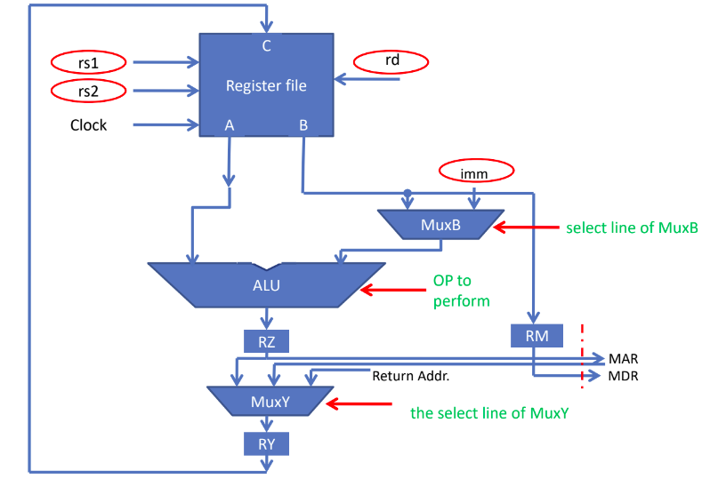
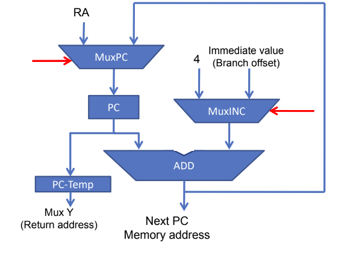
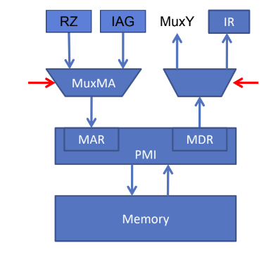

# RISC-V-Simulator

A Simulator for a 32 bit RISC-V Instruction Set Architecture (ISA) built in Python3.

### Team Information & Contributions
	Divyansh Srivastava	2018MEB1009	Instructions of U, SB Format & Memory Organization
	Vikram Setty		2018MED1010	Instructions of UJ Format, Five Stage Execution Datapath & IAG
	Ashish Kaushik		2018MMB1279	Instructions of I Format & GUI
	Shrish Tripathi		2018MMB1294	Instructions of S Format & GUI
	Hrishikesh Pawar	2018MEB1241	Instructions of R Format, Register & PMI Organization
	
### Phase 1
	A simulator to execute a sequence of machine code instructions to mimic the basic data and conrol path of RISC-V ISA
      
### How to Build
	$cd src
	$make
	
### Cleaning the Project:
	$cd src
	$make clean

### How to execute
	./myRISCVSim test/simple_add.mc
	
### Instructions Supported
	R-Type:
		add, and, or, sll, slt, sra, srl, sub, xor, mul, div, rem
	I-Type :
		addi, andi, ori, lb, lh, lw, jalr
	S-Type:
		sb, sw, sh
	SB-Type:
		beq, bne, bge, blt
	U-Type:
		auipc, lui
	UJ-Type:
		jal

### Input File Information
###### The input file should contain a sequence of machine code instructions (corresponding to 32 bit RISC-V instructions) in the format - 'Instruction number followed by machine code. See below example.
	0x00000000 0x00a00e93
	0x00000004 0x00100e13
	0x00000008 0x01d00333
	.
	.
	.
	0x00000048 0x00008067
	0x0000004c 0x00000000

### Datapath for the Execution of a Single Machine Code Instruction
The overall datapath (with control signals) corresponding to the execution of a single instruction looks like (corresponding code in Phase1/five_stage_execution.py) 

 
The Instruction Adress Generator (IAG) for calculating the next program counter (PC) while executing instructions can be visualised as (corresponding code in Phase1/iag.py) 

 
The processor-memory interface for transfer of data between all the registers in the simulated processor and the memory can be depicted by 

 
Source : Slides from CS204 : Computer Architecture by Dr. T.V. Kalyan (IIT Ropar)
