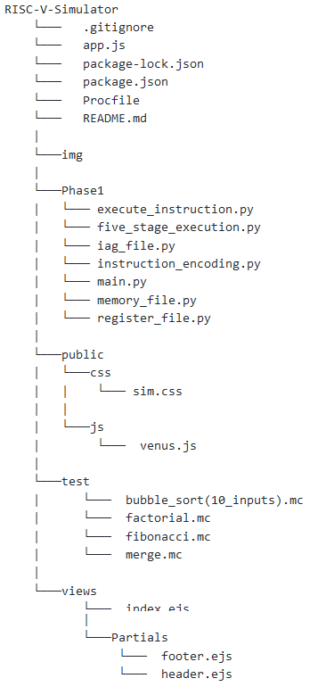

# RISC-V-Simulator

A Simulator for a 32 bit RISC-V Instruction Set Architecture (ISA) built in Python3.

### Team Information
	Divyansh Srivastava	2018MEB1009	
	Vikram Setty		2018MED1010	
	Ashish Kaushik		2018MMB1279	
	Shrish Tripathi		2018MMB1294	
	Hrishikesh Pawar	2018MEB1241	
	
### Phase 1
	A simulator to execute a sequence of machine code instructions to mimic the basic data and control path <br> of RISC-V ISA.
      
### Technology Stack
	Python 3.6(for the development of the simulator)
	HTML, CSS, Node, Express, Javascript (for GUI)

### File Structure
		


* Phase1 - Contains the python files for various stages like instruction decoding, five stage execution, memory file, register file etc.
* test - Contains few testcases to test the validity of the simulator
* public - Contains CSS and JS components of the front-end of the GUI.
* views - Contains the Express.js and JS components for the back-end of the GUI.
* app.js - Main file combining frontend and backend(both express and python components) of the Simulator. 

### How to Execute
   * Locally (Python and Node Required)<br>
  ```
		git clone "repo url"
		npm install
		node app.js
  ```
         Now the simulator can be accessed at http://localhost:80/
	 
   * It is also deployed at https://sheltered-journey-97920.herokuapp.com/#
	
### Instructions Supported
	R-Type:
		add, and, or, sll, slt, sra, srl, sub, xor, mul, div, rem
	I-Type :
		addi, andi, ori, lb, lh, lw, jalr
	S-Type:
		sb, sw, sh
	SB-Type:
		beq, bne, bge, blt
	U-Type:
		auipc, lui
	UJ-Type:
		jal

### Input File Information
###### The input file should contain a sequence of machine code instructions (corresponding to 32 bit RISC-V instructions) in the format - 'Instruction number followed by machine code. See below example.
	0x00 0x00a00e93
	0x04 0x00100e13
	0x08 0x01d00333
	.
	.
	.
	0x48 0x00008067
	0x4c 0x00000000

### Datapath for the Execution of a Single Machine Code Instruction
The overall datapath (with control signals) corresponding to the execution of a single instruction looks like (corresponding code in Phase1/five_stage_execution.py)<br>
<center></center><br>
The Instruction Adress Generator (IAG) for calculating the next program counter (PC) while executing instructions can be visualised as (corresponding code in Phase1/iag.py)<br>
<center></center><br>
The processor-memory interface for transfer of data between all the registers in the simulated processor and the memory can be depicted by<br>
<center></center>
<br>
Source : Slides from CS204 : Computer Architecture by Dr. T.V. Kalyan (IIT Ropar)
